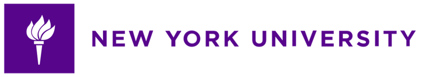

<br><br>

<p align="center">
  &nbsp;&nbsp;&nbsp;
  &nbsp;&nbsp;&nbsp;
  &nbsp;&nbsp;&nbsp;
</p>

<br>

# <p align="center">Cross-Modal Watermarking for Authentic Audio Recovery and Tamper Localization in Synthesized Audiovisual Forgeries</p>

<p align="center">
  <a href="">arXiv</a> | <a href="https://github.com/EuroMinyoung186/CMW_SAVF">Project</a>
</p>

<p align="center">
  by <a href="https://github.com/EuroMinyoung186">Minyoung Kim</a>*,
  <a href="">Sehwan Park</a>,
  <a href="https://sites.google.com/view/sungmin-cha/">Sungmin Cha</a>†,
  <a href="https://miil.korea.ac.kr/">Paul Hongsuck Seo</a>†
</p>

## Introduction

This is our official implementation of Cross-Modal Watermarking for Authentic Audio Recovery and Tamper Localization in Synthesized Audiovisual Forgerie


In this work, we aim to recover authentic audio and localize temporally tampered regions in Synthesized Audiovisual Forgeries (SAVFs), which are generated via voice cloning and lip synchronization. 

For further details, please check out our [Paper](https://arxiv.org/abs/) and our [Project](https://eurominyoung186.github.io/CMW_SAVF/) page.

## :fire:TODO
- [x] Code Release

## Installation
```
pip install -r requirements.txt
```


## Data Preparation

## Training

## Inference

## Acknowledgement

## Citation
```BibTeX

```
